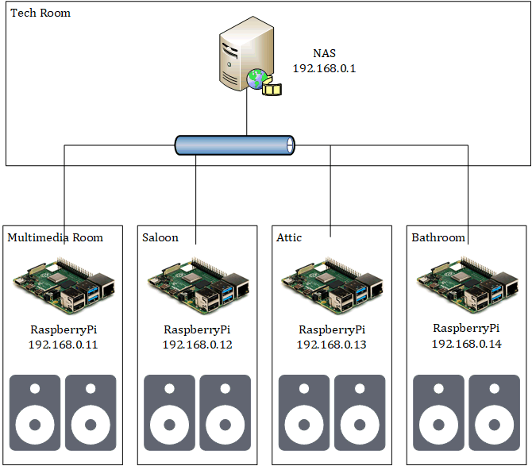
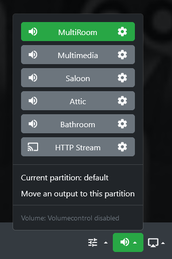
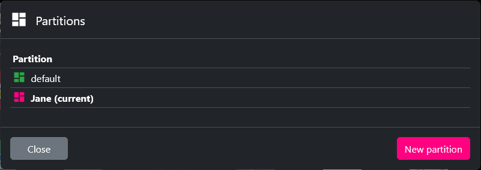
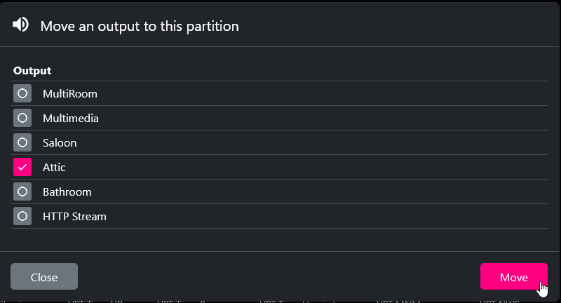
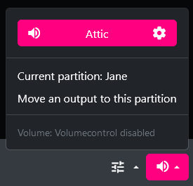

## Introduction

Let's say you have the following setup:

- A central NAS with your own music collection running mympd/mpd
- A few low-powered embedded devices connected to audio systems in different rooms throughout your house.



You can use mpd/mympd's partition feature to enable a multiroom audio system leveraging Pulseaudio RTP streaming between your NAS and your low-powered devices.

You then get on the central myMPD interface the option to select to which output your player will be outputting:


In this case, you could can either stream to all rooms using the "Multiroom" output, which then uses pulseaudio rtp multicast output to stream a single synchronized audio flow to all receivers, or output to a single room, which then uses pulseaudio rtp unicast output to stream to the selected receiver.

Please note that perfect audio synchronisation with multiple audio receivers can only be achieved using a multicast output.

If you want to play different audio/playlists to differents zones, just create a new partition


Move the outputs you want to link to that partition:






Now, the partition "Jane" has its own player, its own playlist and its own output(s).

## Configuration

Let's use the following table as configuration reference in this example:

| Room       | RTP Sink | Streaming Destination Address |
|------------|----------|-------------------------------|
| All        | rtp      | 239.0.0.100 (MultiCast)       |
| Multimedia | rtpm     | 192.168.0.11                  |
| Saloon     | rtps     | 192.198.0.12                  |
| Attic      | rtpa     | 192.198.0.13                  |
| Bathroom   | rtpb     | 192.198.0.14                  |

PulseAudio needs to run as system service on all devices:

- the emitter (NAS)
- and the receivers (Raspberry pis or orther low powered receiver device).

MPD and myMPD will only run on the NAS.

### On all systems (NAS and receivers)

#### Install PulseAudio (if not already installed)

```sh
apt install pulseaudio,pulseaudio-utils,pulsemixer
```

#### Have Pulse audio start as system service with the following pulseaudio systemd unit file

```sh
# cat <<EOF > /lib/systemd/system/pulseaudio.service
[Unit]
Description=PulseAudio Daemon
After=network.target

[Install]
WantedBy=multi-user.target

[Service]
Type=simple
PrivateTmp=true
ExecStart=/usr/bin/pulseaudio --system --realtime --disallow-exit --no-cpu-limit --disable-shm
EOF

systemctl daemon-reload
systemctl enable pulseaudio
```

#### Configure Pulseaudio Group Permissions correctly

```sh
## Allow Pulseaudio to access audio devices
# usermod -a -G audio pulse
# usermod -a -G pulse-access root

## Verify
# grep pulse /etc/group
audio:x:29:pulse
pulse:x:110:
pulse-access:x:111:root
```

### On the Central System

#### Allow MPD to output to PulseAudio

```sh
# usermod -a -G pulse-access mpd

## Verify
# grep pulse /etc/group
audio:x:29:pulse
pulse:x:110:
pulse-access:x:111:root,mpd
```

#### Configure PulseAudio to Stream audio over the Network by RTP (RealTime Transport Protocol)

Notice that a distinct sink is configured for each destination device, plus another one for synchronised multiroom audio.

```sh
# cat <<EOF >> /etc/pulse/system.pa
.include /etc/pulse/rtp_server.pa
EOF
```

```sh
# cat <<EOF > /etc/pulse/rtp_server.pa
load-module module-null-sink sink_name=rtp format=s32be channels=2 rate=48000 sink_properties="device.description='MPD RTP Multicast Sink'"
load-module module-rtp-send source=rtp.monitor destination_ip=239.0.0.100
set-default-sink rtp

load-module module-null-sink sink_name=rtpm format=s32be channels=2 rate=48000 sink_properties="device.description='RTP MultimediaRoom'"
load-module module-rtp-send source=rtpm.monitor destination_ip=192.168.0.11

load-module module-null-sink sink_name=rtps format=s32be channels=2 rate=48000 sink_properties="device.description='RTP Saloon'"
load-module module-rtp-send source=rtps.monitor destination_ip=192.168.0.12

load-module module-null-sink sink_name=rtpa format=s32be channels=2 rate=48000 sink_properties="device.description='RTP Attic'"
load-module module-rtp-send source=rtpa.monitor destination_ip=192.168.0.13

load-module module-null-sink sink_name=rtpb format=s32be channels=2 rate=48000 sink_properties="device.description='RTP BathRoom'"
load-module module-rtp-send source=rtpb.monitor destination_ip=192.168.0.14
EOF
```

#### Configure MPD to send audio output to the different possible RTP sinks

```sh
# cat /etc/mpd.conf

# Only the Audio Output part from mpd.conf is shown here
# Audio Output ################################################################

# Pulseaudio Output
audio_output {
    type        "pulse"
    name        "MultiRoom"
    sink        "rtp"
}

audio_output {
    type        "pulse"
    name        "Multimedia"
    sink        "rtpm"
}

audio_output {
    type        "pulse"
    name        "Saloon"
    sink        "rtps"
}

audio_output {
    type        "pulse"
    name        "Attic"
    sink        "rtpa"
}

audio_output {
    type        "pulse"
    name        "Bathroom"
    sink        "rtpb"
}

audio_output {
    type            "httpd"
    name            "HTTP Stream"
    encoder         "vorbis"        # optional, vorbis or lame
    port            "8000"
    bind_to_address "127.0.0.1"
#   quality         "5.0"           # do not define if bitrate is defined
    bitrate         "128"           # do not define if quality is defined
    format          "44100:16:1"
    max_clients     "0"
}
```

### On the satellite systems

No need to install mpd/mympd; only pulseaudio is required.

#### Configure PulseAudio to receive audio over the Network by RTP (RealTime Transport Protocol)

```sh
# cat <<EOF >> /etc/pulse/system.pa
.include /etc/pulse/rtp.pa
EOF
```

##### Specific config file in Multimedia Room Embedded device

```sh
# cat << EOF > /etc/pulse/rtp.pa
### Load the RTP receiver module
load-module module-rtp-recv sap_address=239.0.0.100
load-module module-rtp-recv sap_address=192.168.0.11
```

##### Specific config file in Saloon Embedded device

```sh
# cat << EOF > /etc/pulse/rtp.pa
### Load the RTP receiver module
load-module module-rtp-recv sap_address=239.0.0.100
load-module module-rtp-recv sap_address=192.168.0.12
```

##### Specific config file in Attic Embedded device

```sh
# cat << EOF > /etc/pulse/rtp.pa
### Load the RTP receiver module
load-module module-rtp-recv sap_address=239.0.0.100
load-module module-rtp-recv sap_address=192.168.0.13
```

##### Specific config file in Bathroom Embedded device

```sh
# cat << EOF > /etc/pulse/rtp.pa
### Load the RTP receiver module
load-module module-rtp-recv sap_address=239.0.0.100
load-module module-rtp-recv sap_address=192.168.0.14
```

#### Reload PulseAudio and verify it's running fine

The service must be started.

On the receivers, the incoming RTP flows (unicast and multicast) should appear under the audio interface that's outputting them.

```sh
# systemctl restart pulseaudio
# systemctl status pulseaudio

● pulseaudio.service - PulseAudio Daemon
     Loaded: loaded (/lib/systemd/system/pulseaudio.service; enabled; vendor preset: enabled)
     Active: active (running) since Thu 2023-02-02 19:13:16 UTC; 3h 1min ago
   Main PID: 230 (pulseaudio)
      Tasks: 3 (limit: 250)
        CPU: 7min 46.785s
     CGroup: /system.slice/pulseaudio.service
             └─230 /usr/bin/pulseaudio --system --realtime --disallow-exit --no-cpu-limit --disable-shm

Feb 02 19:13:18 dockstar pulseaudio[230]: W: [pulseaudio] main.c: Please read http://www.freedesktop.org/wiki/Software/PulseAudio/Documentation/User/WhatIsWrongWithSystemWide/ for an explanation why system mode is usually a bad idea.
Feb 02 19:13:19 dockstar pulseaudio[230]: W: [pulseaudio] authkey.c: Failed to open cookie file '/var/run/pulse/.config/pulse/cookie': No such file or directory
Feb 02 19:13:19 dockstar pulseaudio[230]: W: [pulseaudio] authkey.c: Failed to load authentication key '/var/run/pulse/.config/pulse/cookie': No such file or directory
Feb 02 19:13:19 dockstar pulseaudio[230]: W: [pulseaudio] authkey.c: Failed to open cookie file '/var/run/pulse/.pulse-cookie': No such file or directory
Feb 02 19:13:19 dockstar pulseaudio[230]: W: [pulseaudio] authkey.c: Failed to load authentication key '/var/run/pulse/.pulse-cookie': No such file or directory
Feb 02 19:13:20 dockstar pulseaudio[230]: W: [pulseaudio] main.c: Unable to contact D-Bus: org.freedesktop.DBus.Error.FileNotFound: Failed to connect to socket /run/dbus/system_bus_socket: No such file or directory

## PulseMixer Output on the NAS
# pulsemixer

F1 Output  F2 Input  F3 Cards                                             ? - help
*MPD RTP Multicast Sink                               100 -┌ ████████████     ┐-
                                                          -└ ████████████     ┘-

 RTP MultimediaRoom                                   100  ┌ ████████████     ┐ 
                                                           └ ████████████     ┘

 RTP Saloon                                           100  ┌ ████████████     ┐
                                                           └ ████████████     ┘

 RTP Attic                                            100  ┌ ████████████     ┐
                                                           └ ████████████     ┘

 RTP BathRoom                                         100  ┌ ████████████     ┐
                                                           └ ████████████     ┘

## PulseMixer Output on the receivers
# pulsemixer

F1 Output  F2 Input  F3 Cards                                             ? - help
*PCM2902 Audio Codec Analog Stereo                    100 -┌ ████████████     ┐-
 │                                                        -└ ████████████     ┘-
 ├─Rtp Stream (PulseAudio RTP Stream on 192.168.0.1   100  ┌ ████████████     ┐
 │                                                         └ ████████████     ┘
 └─Rtp Stream (PulseAudio RTP Stream on 192.168.0.1   100  ┌ ████████████     ┐
                                                           └ ████████████     ┘
```

#### CPU consumption on satellite devices

is very low due to the heavy lifting being done on the central node:

Example here with a Seagate Dockstar (a low powered ARM plug computer) being used as audio receiver.

All operations regarding the scanning of the music collection, the playlists, etc only happens on the central node.
